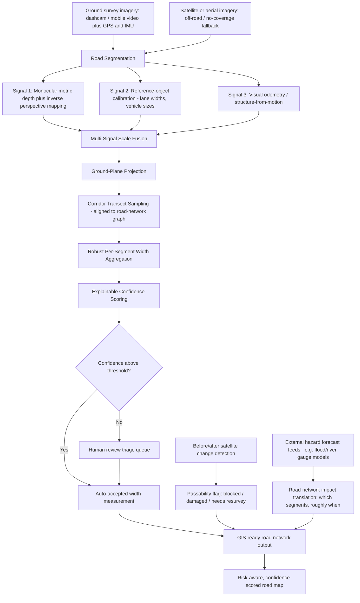

# Scalable, Trustworthy Road-Width Measurement from Multi-Source Survey Data

## 1. Problem Statement

Road imagery contains rich information about a road's physical characteristics, but turning that information into reliable, scalable measurements is hard. Perspective distortion, changing road geometry, inconsistent recording conditions, and incomplete or ambiguous data all make manual-style measurement difficult to automate and difficult to trust. The goal: derive real-world road-width measurements from available survey data with minimal manual intervention, work across different road environments, degrade gracefully when information is incomplete, and report how trustworthy each measurement is.

## 2. Core Idea

The central difficulty is not "measuring a road" — it is **recovering absolute real-world scale from imagery that has none by default**, while road geometry keeps changing and a meaningful fraction of frames will always have something ambiguous in them (occlusion, missing markings, poor lighting, no ground survey at all).

Instead of relying on one fragile scale-recovery method (e.g., a fixed camera-height assumption), this solution **fuses three independent, low-cost scale signals** per road segment, so it degrades gracefully rather than failing silently, and reports **where these signals agree or disagree as the trust signal itself** — turning "how confident are we" from an afterthought into the natural output of the same fusion step that produces the measurement.

## 3. Complete Solution Flowchart

## 4. Stage-by-Stage Explanation

### 4.1 Data ingestion
Accepts heterogeneous, already-available survey data rather than requiring purpose-built sensors: dashcam or mobile video with GPS/IMU logs, optionally stereo or LiDAR if a survey vehicle has it, and satellite/aerial imagery as a fallback for roads with no ground coverage at all. This keeps the barrier to deployment low — a phone with a camera and GPS is enough to start.

### 4.2 Road segmentation
A lightweight semantic segmentation model identifies the drivable road surface and its edges in each frame. It is trained on a mix of structured-road datasets (e.g. Mapillary Vistas, BDD100K) and unstructured/informal-road datasets (e.g. the Indian Driving Dataset) so it does not collapse on rural roads with no lane markings — a common real-world failure mode for models trained only on well-marked highways.

### 4.3 Multi-signal scale recovery (the core innovation)
A monocular image has no inherent sense of scale — a road could be photographed to look any width depending on assumed camera height and pitch. Three independent signals are computed and cross-checked instead of trusting one:

- **Monocular metric depth + inverse perspective mapping (IPM):** a pretrained metric-depth model estimates per-pixel depth, which is combined with camera intrinsics (self-calibrated from vanishing points if not known in advance) to project the road mask onto a locally-planar ground plane.
- **Reference-object calibration:** objects of known real-world size already present in the scene — standard lane-marking widths, statistically average vehicle widths, curb heights — act as an in-scene "ruler" that independently verifies the depth-based scale.
- **Visual odometry / structure-from-motion:** consecutive frames, chained via GPS/IMU or pure visual tracking, turn a single monocular camera into a pseudo-stereo rig, yielding a third independent scale estimate with no extra hardware required.

Where all three agree, scale is well-constrained. Where they diverge, that divergence is itself the first input to the confidence score.

### 4.4 Ground-plane projection
The fused scale estimate is used to project the segmented road mask into real-world (metric) ground-plane coordinates, correcting for the perspective distortion that makes distant parts of the road appear narrower.

### 4.5 Corridor transect sampling
Rather than trusting a single global or per-frame width estimate, frames are chained along the road using GPS map-matching to a road-network graph (e.g. via OpenStreetMap). At fixed real-world intervals (e.g. every 5–10 m) along the road's heading, a perpendicular transect is cast across the projected ground-plane mask to measure width at that specific cross-section. This is what makes the method robust to changing road geometry — curves, tapers, and intersections are captured as local width changes rather than smoothed away by a single road-level number.

### 4.6 Robust per-segment aggregation
Multiple transects, potentially from multiple passes or viewing angles of the same stretch of road, are combined using robust statistics (e.g. median/percentile rather than mean) so that a single occluded or noisy observation does not dominate the segment's reported width. A smoothness prior (road width changes gradually except at genuine features like junctions) helps down-weight outlier transects.

### 4.7 Explainable confidence scoring
Each measurement is assigned a confidence score built from interpretable components rather than a single opaque number:
- Agreement between the three scale-recovery signals
- Segmentation-boundary certainty (pixel-level uncertainty at the road edge)
- Number of independent observations covering that segment
- Environmental quality flags (motion blur, low light, rain, occlusion percentage)
- Geometric plausibility against neighboring segments

The system generates a short, human-readable reason alongside the score (e.g., "medium confidence: single pass, partial occlusion, signals agree within 4%"), so a reviewer knows *why* a measurement needs attention rather than just that it does.

### 4.8 Extension: satellite/aerial fallback for off-road coverage
For roads with no ground-level survey data, the same segmentation approach is applied to satellite or aerial imagery to detect road existence and classify width into coarse buckets (e.g., footpath / single-lane / double-lane / highway). This is explicitly a lower-resolution, lower-confidence fallback tier — free optical satellite imagery (~10 m/pixel) cannot resolve a road's width precisely, and even sub-meter commercial imagery (Maxar, Planet SkySat, ISRO Cartosat-3) is tasked and delivered with latency, not live. It closes coverage gaps; it does not replace ground-level precision.

### 4.9 Extension: post-disaster change detection
Comparing before/after satellite scenes of the same road corridor — ideally using SAR imagery (e.g. Sentinel-1), which sees through the cloud cover that typically accompanies floods and landslides — detects when a road segment has become obstructed or washed out. This flips the segment's status to "obstructed / needs resurvey" using infrastructure already built for segmentation, at near-zero additional cost. This is detection of a disaster's aftermath, not prediction of the disaster itself.

### 4.10 Extension: external hazard-forecast integration
True hazard prediction (e.g., river flood arrival times) is a hydrological forecasting problem outside this system's scope, and outside what should be built from scratch for a measurement tool. Instead, this layer **ingests an existing hazard forecast** (e.g., a river-basin flood model such as Google Flood Hub, or a national river/meteorological authority's bulletin) and performs the translation step that is this system's genuine value-add: mapping the forecast's predicted inundation extent and timing onto the road-network graph and elevation data already built for width measurement, to flag which specific segments or bridges are likely affected and roughly when. The hazard forecast is a consumed external signal, not a capability this system invents.

### 4.11 Output and human-in-the-loop triage
Final output is a GIS-ready road network (shapefile/GeoJSON) with per-segment width, confidence score and explanation, passability status, and any hazard-impact flags — visualizable as a color-coded map. Only low-confidence segments are routed to human reviewers, which is what makes "minimal manual intervention" achievable at network scale: automation handles the majority, and reviewer time is spent only where the system is honestly uncertain.

## 5. Handling Incomplete or Ambiguous Data

| Situation | Approach |
|---|---|
| Occlusion (parked vehicles, shadows, pedestrians) | Aggregate across multiple passes/angles of the same segment; robust statistics down-weight outliers; smoothness prior across neighboring transects |
| No lane markings (rural/unstructured roads) | Segmentation model trained on unstructured-road data; falls back to vegetation cut-line, curb, or surface-transition cues |
| No or poor GPS (tunnels, urban canyons) | Falls back to pure visual odometry for frame chaining, losing georeferencing but not relative scale |
| Unknown camera calibration | Self-calibration via vanishing-point detection on parallel road edges/lane lines |
| No ground survey at all | Satellite/aerial fallback tier (Section 4.8), explicitly lower confidence |
| Road obstructed post-disaster | Before/after change detection flags the segment rather than reporting a stale or wrong width |

## 6. Why This Is Unique and Efficient

Most straightforward approaches to this problem pick a single scale-recovery method — typically a fixed camera-height assumption plus inverse perspective mapping — and have no way to know when that assumption silently breaks (a slope, a bend, an uncalibrated camera). This solution is different in three specific ways:

1. **Sensor-agnostic, graceful degradation.** The three-signal fusion works with nothing more than a phone dashcam and GPS, and automatically improves if stereo or LiDAR happens to be available — it does not require special-purpose survey hardware to function at all, which is what makes network-scale deployment realistic.
2. **Trust is a byproduct of the method, not a bolt-on.** Because confidence comes from signal agreement, segmentation certainty, and observation count — all of which the pipeline is already computing — the trustworthiness requirement in the problem statement is answered by the same computation that produces the measurement, and with a human-readable explanation rather than an opaque score.
3. **Corridor-level, graph-aware geometry.** Treating the road as a continuous object tied to a road-network graph (rather than independent per-frame estimates) makes the output directly usable in existing GIS/asset-management workflows and naturally handles changing geometry (curves, tapers, junctions) instead of averaging it away.

## 7. Scalability and Feasibility

- Segmentation and depth models are lightweight enough to run near real-time, so processing can happen incrementally rather than requiring bulk reprocessing of a road network.
- Only flagged low-confidence segments require human review, keeping manual effort proportional to genuine uncertainty rather than to network size.
- The system works with data survey teams likely already collect (dashcam footage, GPS logs), avoiding a hardware-procurement bottleneck.

## 8. Suggested Technology Stack (Hackathon-Scale Build)

- **Segmentation:** fine-tune a lightweight pretrained model (e.g. SegFormer-B0) on a small slice of Mapillary Vistas / Indian Driving Dataset, or use Segment Anything with road-class prompts for a faster demo
- **Metric depth:** pretrained metric depth model (e.g. Depth Anything V2's metric variant) — no training required
- **Visual odometry:** OpenCV / ORB-based tracking for a demo-scale proof of concept
- **Road-network graph matching:** OSMnx against OpenStreetMap data
- **Satellite change detection:** Sentinel-1/2 imagery via Copernicus Open Access Hub
- **Demo data:** a self-recorded phone dashcam clip with GPS logging, for a fully reproducible demonstration independent of any dataset provided by organizers

## 9. Honest Scope Boundaries

- This system does not perform physics-based hazard prediction (flood arrival timing, landslide onset). That is a distinct hydrological/geotechnical forecasting discipline; this system consumes existing forecasts and translates them onto road infrastructure.
- Satellite-derived width estimates are coarse and explicitly lower-confidence than ground-survey-derived ones; they are a coverage fallback, not a precision source.
- Confidence scoring indicates measurement reliability, not a legal or engineering-grade certification of road condition.

## 10. Conclusion

The problem statement asks for measurements that are automated, scalable, adaptable across road environments, robust to incomplete data, and self-aware about their own reliability. Fusing three independent, hardware-light scale-recovery signals — and deriving trustworthiness directly from their agreement rather than as an afterthought — addresses all of these requirements together, while the satellite and hazard-integration extensions close coverage gaps and add operational value without overstating what the system can predict.
